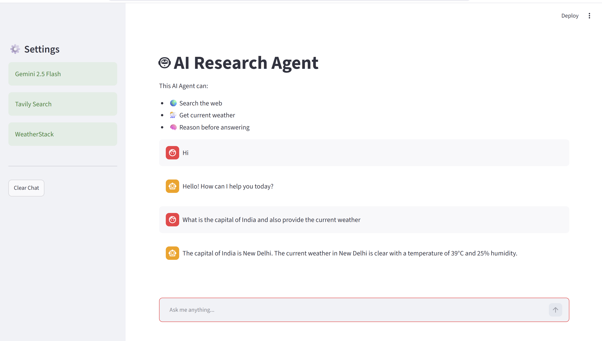
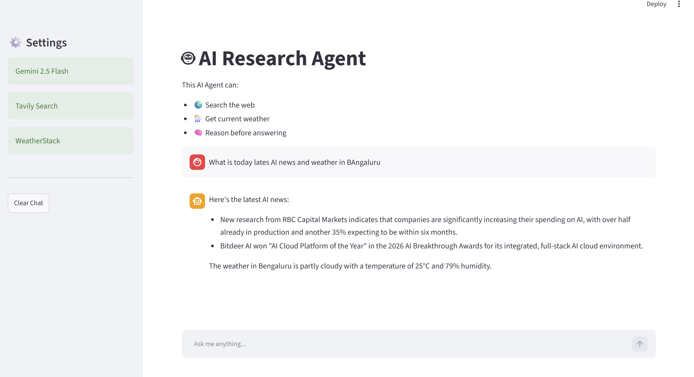
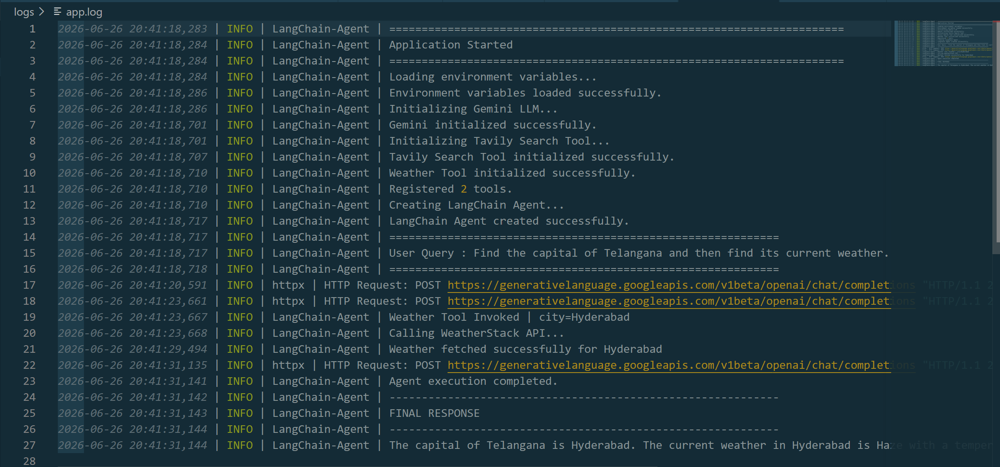

# 🤖 Agentic AI Research Assistant

An intelligent AI Research Assistant built using **LangChain**, **Google Gemini**, **Tavily Search**, **WeatherStack API**, and **Streamlit**.

The application is capable of:

- 🌍 Searching the internet
- 🌦️ Fetching live weather information
- 🧠 Reasoning over multiple tools
- 💬 Conversational interaction
- 📄 Logging all application activities
- ☁️ Ready for AWS deployment

---

# Demo



---

# Features

- Google Gemini 2.5 Flash LLM
- LangChain Agent (Latest `create_agent()` API)
- Tavily Internet Search
- WeatherStack Weather Tool
- Streamlit Chat Interface
- Modular Project Structure
- Production-grade Logging
- Environment Variable Support
- Exception Handling
- AWS Deployment Ready

---

# Tech Stack

| Category | Technology |
|-----------|------------|
| Language | Python 3.12 |
| LLM | Gemini 2.5 Flash |
| Agent Framework | LangChain |
| Search | Tavily |
| Weather | WeatherStack |
| UI | Streamlit |
| Environment | python-dotenv |
| Logging | Python logging |
| Deployment | AWS EC2 |

---

# Project Structure

```
agentic-ai-research-assistant/
│
├── app.py
├── main.py
├── .env
├── README.md
├── requirements.txt
├── pyproject.toml
├── uv.lock
│
├── logs/
│   └── app.log
│
├── src/
│   ├── config.py
│   ├── tools.py
│   └── agent.py
│
└── screenshots/
```

---

# Architecture

```
                 User
                  │
                  ▼
          Streamlit Interface
                  │
                  ▼
          LangChain Agent
                  │
      ┌───────────┴───────────┐
      │                       │
      ▼                       ▼
 Tavily Search          Weather Tool
      │                       │
      └───────────┬───────────┘
                  │
                  ▼
          Gemini 2.5 Flash
                  │
                  ▼
             Final Response
```

---

# Installation

Clone the repository

```bash
git clone https://github.com/ChandraCherupally/agentic-ai-research-assistant.git

cd agentic-ai-research-assistant
```

---

## Create Virtual Environment

Using UV

```bash
uv venv

uv sync
```

or

```bash
python -m venv .venv
```

Activate

Windows

```bash
.venv\Scripts\activate
```

Linux

```bash
source .venv/bin/activate
```

---

# Install Dependencies

Using UV

```bash
uv sync
```

or

```bash
pip install -r requirements.txt
```

---

# Environment Variables

Create a `.env` file.

```
GEMINI_API_KEY=xxxxxxxxxxxxxxxxxxxx

TAVILY_API_KEY=xxxxxxxxxxxxxxxxxxxx

WEATHERSTACK_API_KEY=xxxxxxxxxxxxxxxxxxxx
```

---

# Running the Application

Launch Streamlit

```bash
streamlit run app.py
```

or

```bash
uv run streamlit run app.py
```

Application runs at

```
http://localhost:8501
```

---

# Example Queries

```
Who is the CEO of OpenAI?
```

```
Find the capital of Telangana.
```

```
What is today's weather in Hyderabad?
```

```
Find the capital of Germany and then tell me today's weather there.
```

```
Who won the last FIFA World Cup?
```

---

# Logging

Logs are automatically stored in

```
logs/app.log
```

Example

```
2026-06-26 10:42:11 INFO Loading Environment

2026-06-26 10:42:13 INFO Gemini Initialized

2026-06-26 10:42:20 INFO User Query

2026-06-26 10:42:22 INFO Weather Tool Called

2026-06-26 10:42:25 INFO Response Generated
```

---

# APIs Used

## Google Gemini

Used as the Large Language Model.

Official documentation

https://ai.google.dev/

---

## Tavily Search

Used for internet search.

https://tavily.com/

---

## WeatherStack

Used for live weather information.

https://weatherstack.com/

---

# Error Handling

The application gracefully handles

- Missing API Keys
- Invalid Weather API Response
- Internet Connectivity Issues
- LLM Failures
- Search Tool Failures
- Invalid User Input
- Unexpected Exceptions

All errors are logged.

---

# AWS Deployment

The application can be deployed on

- AWS EC2
- Docker
- ECS
- Kubernetes
- Azure VM
- Google Cloud VM

Recommended Production Stack

```
Internet

↓

Nginx

↓

Streamlit

↓

LangChain Agent

↓

Gemini + APIs
```

---

# Future Enhancements

- Memory Support
- Conversation History
- PDF Question Answering
- RAG Pipeline
- Pinecone Vector Database
- Multi-Agent Architecture
- Docker Deployment
- User Authentication
- CloudWatch Monitoring
- CI/CD with GitHub Actions

---

# Screenshots

## Home Page

(Add screenshot)

---

## Chat Example



---

## Logs


---

# Learning Objectives

This project demonstrates

- Agentic AI
- LangChain Latest APIs
- Tool Calling
- Prompt Engineering
- LLM Integration
- Production Logging
- Streamlit Development
- Environment Management
- Exception Handling
- Clean Project Architecture

---

# License

MIT License

---

# Author

**Cherupally Naveen Chandra**

GitHub

https://github.com/chandracherupally

LinkedIn

https://www.linkedin.com/in/cherupally-naveenchandra/

---

# If you found this project useful

⭐ Star this repository

🍴 Fork the repository

🧑‍💻 Contributions are welcome